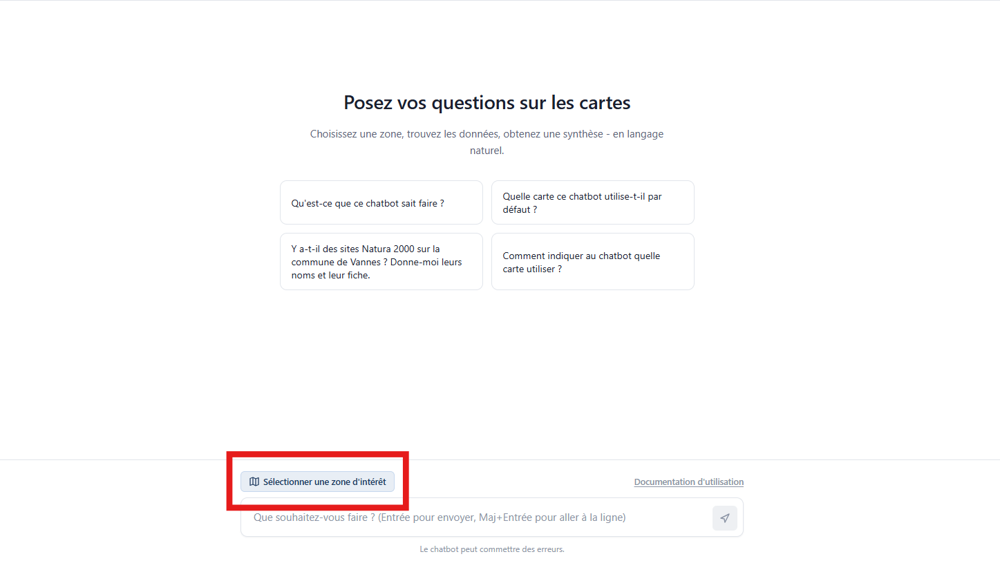
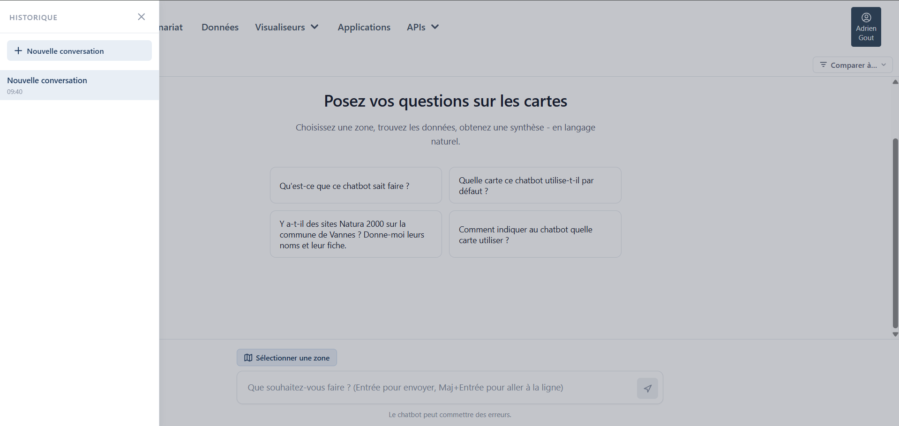
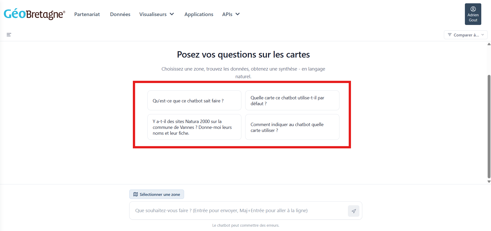
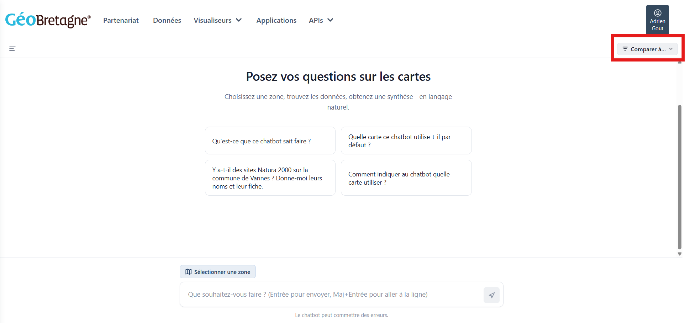

# GeoBretagne Chat UI

Interface de chat IA pour explorer les données géospatiales ouvertes de [GeoBretagne](https://geobretagne.fr).  
L'assistant répond en français, utilise des outils MCP pour interroger les couches WFS/CSW et génère des liens MViewer.

---

## Architecture

```
Utilisateur ──► Interface React (chat + carte Leaflet)
                       │  SSE streaming
                       ▼
              Backend Hono (Node.js)
                       │  MCP StreamableHTTP  (optionnel)
                       ▼
              Serveur MCP GeoBretagne   ◄──► WFS / CSW / MViewer
                       │  API OpenAI-compatible
                       ▼
                  LLM (vLLM / Albert API / autre)
```

Le serveur MCP est **optionnel** : sans `MCP_URL`, le backend fonctionne en mode bot textuel pur (sans outils).

---

## Structure du dépôt

```
Geobretagne-ChatUi/
├── docker-compose.yml              # Orchestration des deux services
├── .env                            # Variables d'environnement (à créer, voir ci-dessous)
│
├── chat-geobretagne/               # Service backend
│   ├── Dockerfile
│   ├── package.json
│   ├── config/
│   │   └── system-prompt.md        # Prompt système de l'assistant (personnalisable)
│   └── src/
│       └── server.ts               # Serveur Hono + agent AI SDK + correctifs vLLM
│
└── mviewer-chat-widget/            # Service frontend
    ├── Dockerfile
    ├── nginx.conf                  # Reverse proxy SSE + SPA routing (template envsubst)
    ├── vite.config.ts
    └── src/
        ├── App.tsx
        ├── types.ts                # Types TypeScript des messages
        ├── comparisons.ts          # Données de comparaison énergétique (kWh)
        ├── components/
        │   ├── ChatPage.tsx        # Page de chat principale
        │   ├── Composer.tsx        # Zone de saisie
        │   ├── Message.tsx         # Rendu Markdown des messages
        │   ├── MapSelector.tsx     # Sélecteur de zone bbox (Leaflet)
        │   ├── LayerPicker.tsx     # Sélection de couches
        │   ├── ComparisonSelector.tsx  # Sélecteur de comparaison kWh
        │   ├── Sidebar.tsx         # Historique des conversations
        │   ├── AgentSettings.tsx   # Panneau de configuration de l'agent
        │   ├── ToolCall.tsx        # Visualisation des appels d'outils MCP
        │   └── Help.tsx            # Page d'aide / présentation des fonctionnalités
        └── hooks/
            ├── useConversations.ts
            └── useAgentConfig.ts
```

### Stack technique

| Couche | Technologie |
|---|---|
| Backend | Node.js 22, [Hono](https://hono.dev), [AI SDK v6](https://sdk.vercel.ai), TypeScript 5 |
| Frontend | React 19, Vite 8, AI SDK React, Leaflet, react-markdown |
| Proxy | nginx (template `envsubst` via `BASE_PATH`) |
| Déploiement | Docker Compose |
| Protocole LLM | OpenAI-compatible (testé : Albert API / vLLM / Ollama) |
| Protocole outils | [MCP](https://modelcontextprotocol.io) via StreamableHTTP |

---

## Fonctionnalités

- **Chat streamé** — réponses en temps réel via Server-Sent Events
- **Agent MCP** — outils géospatiaux : chargement de config MViewer, listes de couches, requêtes WFS, génération de permaliens
- **Mode textuel** — fonctionne sans serveur MCP si `MCP_URL` est absent
- **Sélecteur de zone** — dessin d'une bbox sur une carte Leaflet, transmise automatiquement à l'assistant
- **Historique des conversations** — stocké en `localStorage`, navigable via la sidebar
- **Paramètres de l'agent** — panneau `AgentSettings` pour ajuster le comportement depuis l'UI
- **Correctifs vLLM** — patch transparent sur les trois incompatibilités connues entre AI SDK v6 et vLLM
- **Sécurité** — CORS restreint aux domaines `*.geobretagne.fr`, headers HTTP durcis, limite de taille des requêtes (100 Ko, 50 messages max)

---

## Prérequis

- [Docker](https://docs.docker.com/get-docker/) et [Docker Compose](https://docs.docker.com/compose/) v2
- Un **LLM avec API OpenAI-compatible** supportant le `tool_use`  
  (ex : [Albert API](https://albert.api.etalab.gouv.fr), vLLM, Ollama, OpenAI…)
- *(Optionnel)* Un **serveur MCP GeoBretagne** accessible via HTTP

---

## Démarrage rapide

### 1. Cloner le dépôt

```bash
git clone https://github.com/adriengout/Geobretagne-ChatUi.git
cd Geobretagne-ChatUi
```

### 2. Créer le fichier `.env`

Créer un fichier `.env` à la racine du projet :

```env
# URL de base de l'API LLM (compatible OpenAI)
BASE_URL=votre-lien-api

# Clé API du LLM
API_KEY=votre-clé-api

# Identifiant du modèle
MODEL=mistralai/Ministral-3-8B-Instruct-2512

# URL StreamableHTTP du serveur MCP (optionnel — sans cette variable, mode textuel pur)
MCP_URL=https://geobretagne.fr/mcp/mviewer

# Chemin de base du frontend (doit commencer par /)
BASE_PATH=/chat
```

> `MCP_URL` est **optionnel**. Sans lui, l'assistant répond en mode textuel sans accès aux données géographiques.

### 3. Lancer les services

```bash
docker compose up --build -d
```

L'interface est disponible sur **`http://localhost:8080/chat`** (selon la valeur de `BASE_PATH`).

```bash
# Suivi des logs en direct
docker compose logs -f
```

> **Réseau Docker externe** : si le serveur MCP tourne dans un autre `docker compose`, décommenter le bloc `mcp_network` dans `docker-compose.yml` et ajuster le nom du réseau.

---

## Variables d'environnement

| Variable | Obligatoire | Défaut | Description |
|---|---|---|---|
| `BASE_URL` | Oui | — | URL de base de l'API LLM (ex : `https://albert.api.etalab.gouv.fr/v1`) |
| `API_KEY` | Oui | — | Clé d'authentification de l'API LLM |
| `MODEL` | Oui | — | Identifiant du modèle (ex : `mistralai/Ministral-3-8B-Instruct-2512`) |
| `MCP_URL` | Non | *(vide)* | URL StreamableHTTP du serveur MCP — absent = mode textuel |
| `BASE_PATH` | Non | `/chat` | Chemin de base nginx + Vite (doit commencer par `/`) |

---

## Développement local

### Backend

```bash
cd chat-geobretagne
# Créer un .env local avec les variables (ou copier depuis la racine)
npm install
npm run dev        # tsx watch — rechargement automatique sur :3000
```

### Frontend

```bash
cd mviewer-chat-widget
npm install
npm run dev        # Vite dev server sur :5173
```

Le proxy Vite (`/api → http://localhost:3000`) est préconfigué dans `vite.config.ts` — aucun réglage supplémentaire n'est nécessaire.

### Scripts disponibles

**Backend** (`chat-geobretagne/`) :

| Commande | Description |
|---|---|
| `npm run dev` | Serveur avec rechargement automatique |
| `npm run build` | Compilation TypeScript |
| `npm run start` | Démarre le build compilé |
| `npm run test:mcp` | Test de connexion au serveur MCP (`src/test-mcp.ts` à créer) |
| `npm run test:chat` | Test d'envoi d'un message au backend (`src/test-chat.ts` à créer) |

**Frontend** (`mviewer-chat-widget/`) :

| Commande | Description |
|---|---|
| `npm run dev` | Serveur Vite dev |
| `npm run build` | Build de production |
| `npm run lint` | ESLint |
| `npm run preview` | Prévisualisation du build |

---

## Outils MCP disponibles

L'assistant accède aux outils suivants via le serveur MCP (si `MCP_URL` est configuré) :

| Outil | Rôle |
|---|---|
| `check_mviewer` | Valider une URL de configuration MViewer |
| `load_xml` | Charger le contexte MViewer depuis une URL XML |
| `list_themes` | Lister les thèmes d'une configuration |
| `list_layers_by_theme` | Lister les couches d'un thème |
| `list_all_layers` | Liste complète de toutes les couches (coûteux — 1 appel max par conversation) |
| `get_metadata` | Métadonnées CSW + URL WFS d'une couche |
| `get_bbox` | Calculer une bbox autour d'une commune française |
| `spatial_analysis` | Scan rapide de toutes les couches sur une bbox — retourne les `layer_id` contenant des données dans la zone |
| `spatial_query` | Requête WFS spatiale (bbox + tableau de `layer_id`) |
| `bbox_to_mviewer_url` | Générer un lien MViewer permalink depuis une bbox + liste de couches |

Le comportement détaillé (workflow, règles, gestion des résultats tronqués) est défini dans [`chat-geobretagne/config/system-prompt.md`](chat-geobretagne/config/system-prompt.md).

---

## Notes techniques

### Correctifs vLLM

Le backend intercepte chaque requête POST vers le LLM (`vllmFixerFetch`) pour corriger trois incompatibilités entre AI SDK v6 et vLLM :

1. **`tool_choice` absent** → vLLM ignore les outils : forcé à `"auto"` quand des outils sont présents.
2. **`content: ""`** sur un message `assistant` avec `tool_calls` → crash vLLM : remplacé par `null`.
3. **Contenu des messages `tool`** sérialisé en JSON par le SDK → vLLM attend une chaîne simple : désérialisé et aplati.

Ces correctifs sont transparents et n'affectent pas le flux de réponse streaming.

### Client MCP singleton

Le client MCP est initialisé une seule fois au démarrage et réutilisé entre toutes les requêtes. Créer un nouveau transport par requête perdrait le `sessionId` entre l'initialisation et les appels d'outils.

### Template nginx

`nginx.conf` est copié dans `/etc/nginx/templates/` et traité par `envsubst` au démarrage du conteneur. Seule `${BASE_PATH}` est substituée — les variables internes nginx (`$uri`, `$host`…) ne sont pas affectées.

### Sécurité CORS

Le backend autorise uniquement `https://geobretagne.fr`, `https://www.geobretagne.fr` et les sous-domaines `*.geobretagne.fr`. En développement (`NODE_ENV !== 'production'`), `localhost:5173` et `localhost:3000` sont également autorisés.

---

## Captures d'écran

| Sélection de zone | Historique |
|---|---|
|  |  |

| Suggestions de prompt | Comparaisons énergétiques |
|---|---|
|  |  |

---

## Licence

Ce projet est développé dans le cadre du projet [GeoBretagne](https://geobretagne.fr).
